### Attainment AI for Teachers

This project is to ease the workload of teachers but providing NLP models to find blooms taxonomy and Course Outcome mappings
It also automates the manual process and calculations.

To run project locally - 
```bash 
    go run .
```

```bash 
    npm start 
```

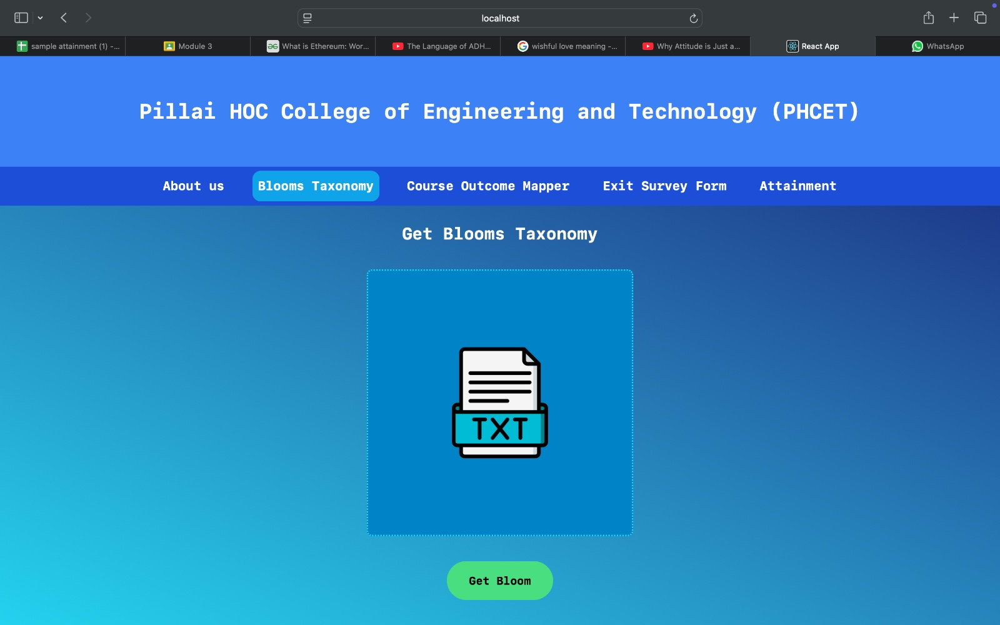
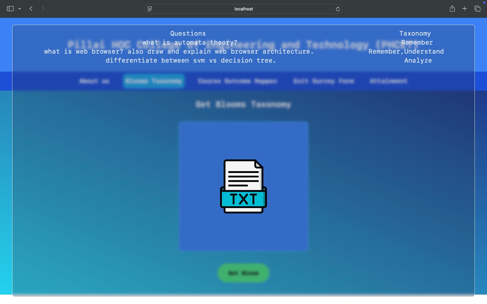
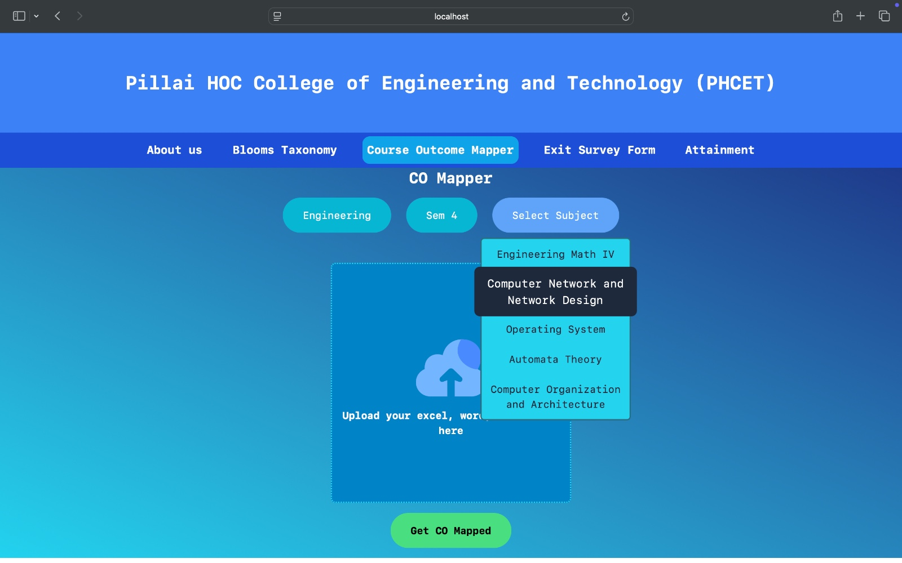
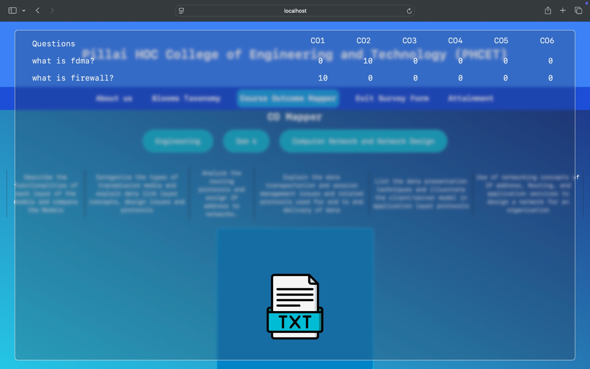
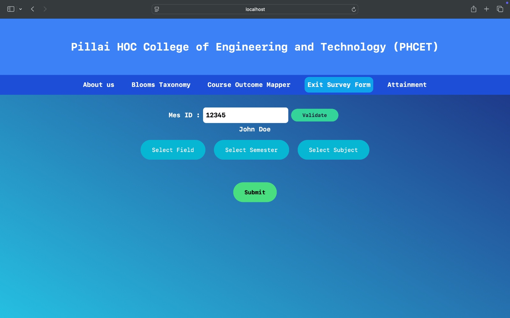
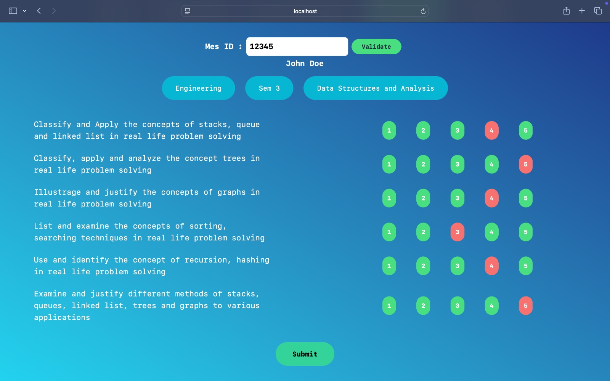
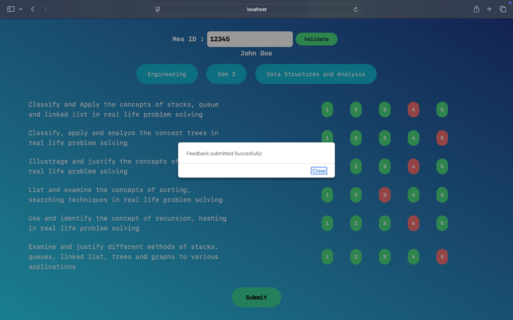
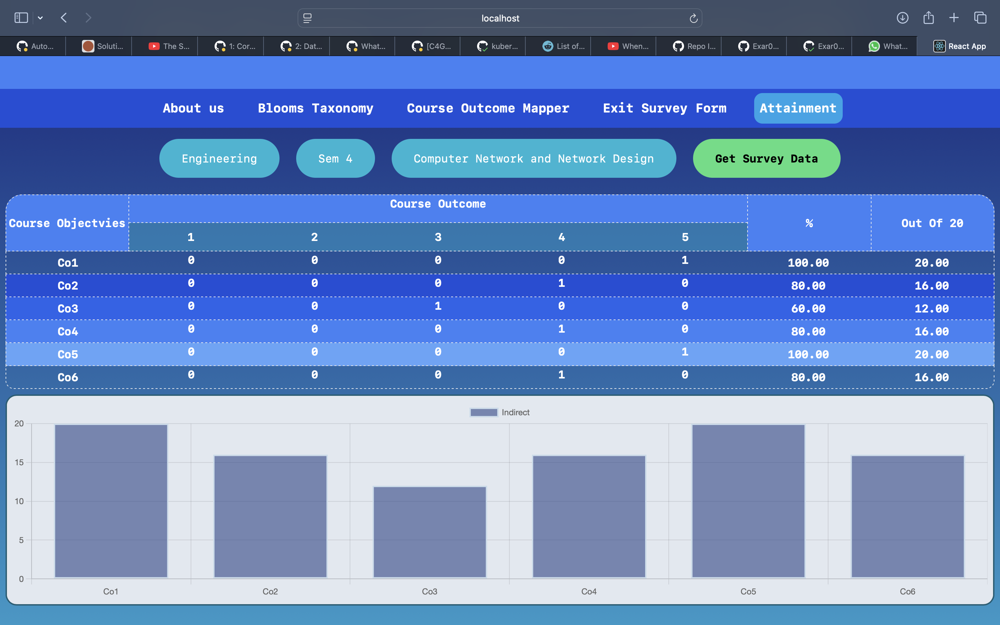
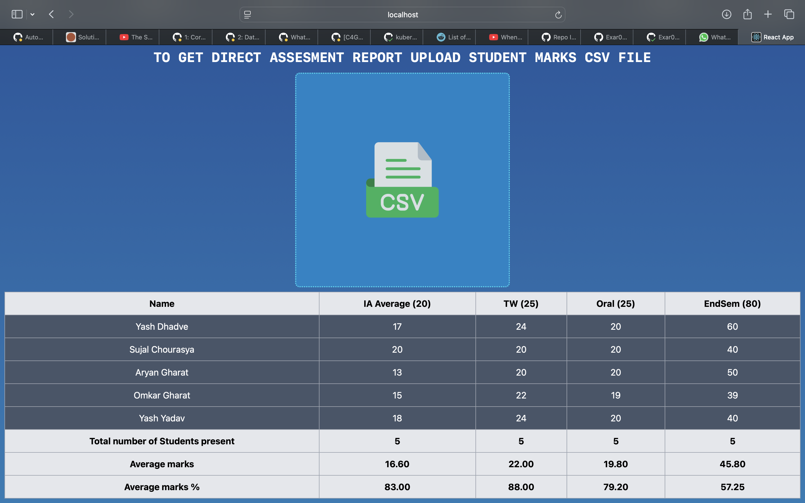
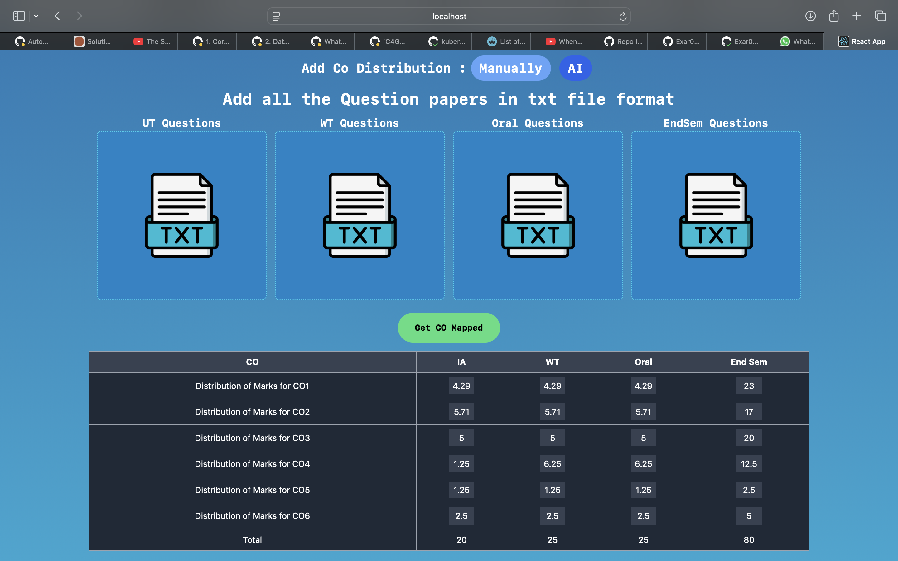
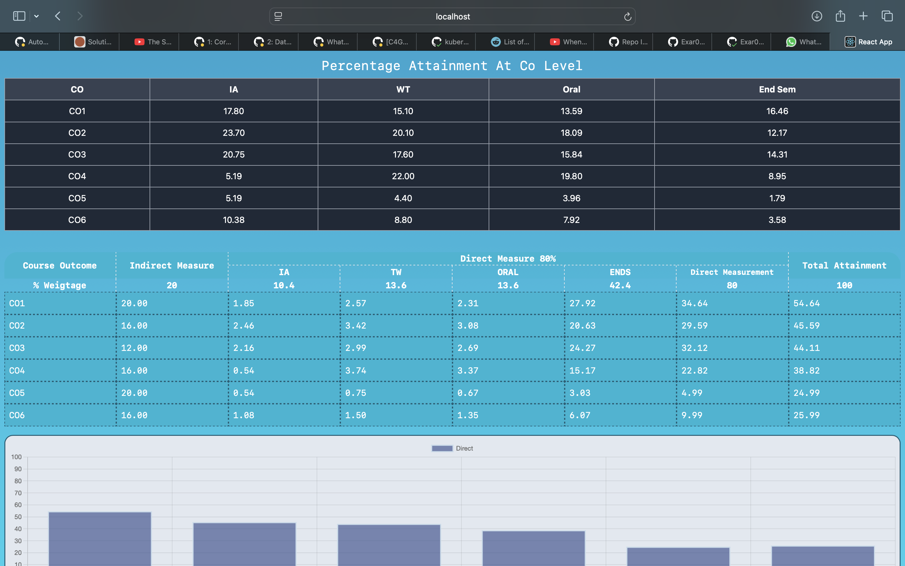